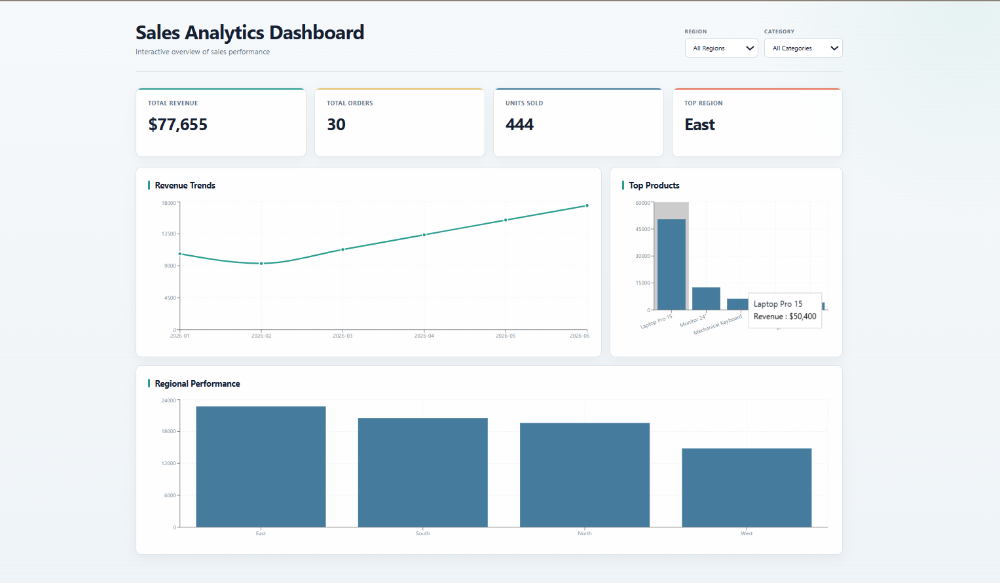
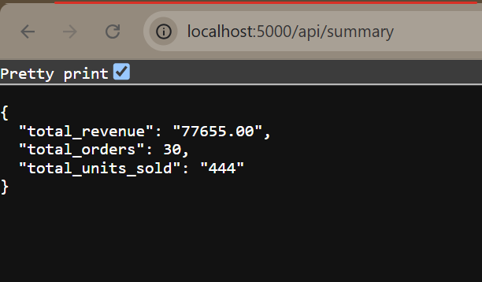
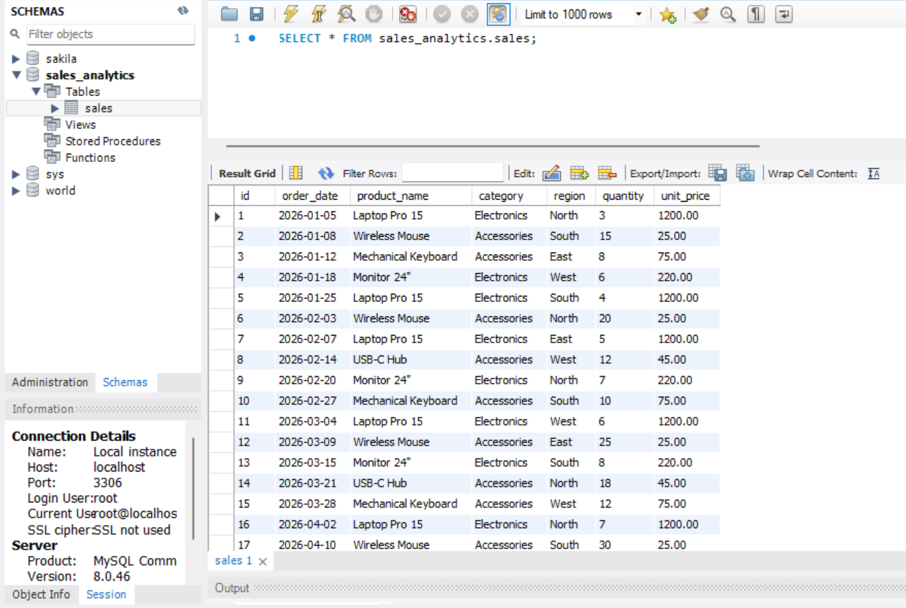

# Interactive Sales Analytics Dashboard

A full-stack sales analytics dashboard for exploring revenue, orders, units sold, products, and regional performance. It combines a MySQL data source, a Node.js/Express API, and a React dashboard built with Recharts.

## Project Overview

The application turns transactional sales records into a responsive business intelligence view. Users can monitor headline KPIs, inspect revenue trends, compare products and regions, and interactively filter results by region and category.

## Objectives

- Convert transactional sales data into actionable summary metrics.
- Provide reusable API endpoints for dashboard aggregates.
- Compare performance across regions and product categories.
- Present trends and rankings in a clear, responsive interface.

## Features

- KPI cards for total revenue, total orders, units sold, and top region.
- Monthly revenue trend line chart.
- Top-products revenue bar chart.
- Regional revenue performance bar chart.
- Interactive `Region` and `Category` dropdown filters.
- Filtered KPI requests through `/api/dashboard`.
- Client-side filtered chart data derived from `/api/sales` records.
- Loading and error states in the React client.

## Technology Stack

- **Database:** MySQL
- **Backend:** Node.js, Express, `mysql2/promise`, CORS, dotenv
- **Frontend:** React, Vite, Recharts
- **Tooling:** Oxlint and Vite production builds

## System Architecture

```text
MySQL `sales` table
        |
        v
Node.js + Express API (port 5000)
        |
        v
React + Vite client (port 5173)
        |
        v
Recharts visualizations and interactive filters
```

The frontend requests dashboard aggregates and sales records from the backend. Filter selections are sent to `/api/dashboard` for KPI calculations, while the loaded sales records are filtered in the client to update the charts. `All Regions` and `All Categories` omit their respective query parameters.

## Database Structure

The backend reads from a MySQL table named `sales`:

| Column | Usage |
| --- | --- |
| `id` | Sale identifier |
| `order_date` | Date used for monthly trends |
| `product_name` | Product grouping |
| `category` | Category filter |
| `region` | Regional filter and grouping |
| `quantity` | Units and order calculations |
| `unit_price` | Revenue calculation |

Revenue is calculated as `quantity * unit_price` in the application queries; it is not stored as a separate field in those queries.

## Data Analysis

- **Total revenue:** `SUM(quantity * unit_price)`
- **Total orders:** `COUNT(*)`
- **Units sold:** `SUM(quantity)`
- **Average sale value:** `AVG(quantity * unit_price)` from the filtered dashboard endpoint
- **Revenue trends:** monthly revenue grouped by `YYYY-MM`
- **Top products:** products ranked by total revenue
- **Regional performance:** regions ranked by total revenue

## Actual Findings

The current dashboard data shows:

- **30 total orders** and **444 units sold**.
- **$77,655 total revenue**.
- **$2,588.50 average sale value** based on the displayed total and order count.
- **East** is the highest-performing region; **West** is the lowest among the displayed regions.
- **Laptop Pro 15** is the leading product, with **$50,400 revenue** in the displayed chart.
- Monthly revenue dips in February, then increases through June, which is the highest month shown.
- The dataset includes Electronics and Accessories categories in the displayed records.

These findings describe the current sample data and will change when the MySQL data changes or filters are applied.

## API Endpoints

All endpoints are served from `http://localhost:5000`.

| Method | Endpoint | Purpose |
| --- | --- | --- |
| `GET` | `/` | API health message |
| `GET` | `/api/sales` | All sales records used by the dashboard and filters |
| `GET` | `/api/summary` | Unfiltered summary metrics |
| `GET` | `/api/revenue-trends` | Monthly revenue aggregates |
| `GET` | `/api/top-products` | Product revenue and units sold |
| `GET` | `/api/regional-performance` | Regional revenue and units sold |
| `GET` | `/api/dashboard` | Summary metrics with optional `region` and `category` filters |

Examples:

```text
/api/dashboard
/api/dashboard?region=East
/api/dashboard?category=Electronics
/api/dashboard?region=East&category=Electronics
```

## Interactive Filters

The dashboard provides `All Regions` and `All Categories` defaults. Selecting a region, category, or both updates the KPI cards through the parameterized dashboard endpoint and updates all existing charts from matching sales records. Clearing a filter restores the complete dataset; chart panels remain visible throughout.

## Project Structure

```text
.
├── README.md
├── API_Summary.png
├── MySQL_Sales_Data.png
├── dashboard_overview.png
├── backend/
│   ├── .env.example
│   ├── db.js
│   ├── package.json
│   ├── server.js
│   └── test-db.js
└── frontend/
    ├── package.json
    ├── vite.config.js
    └── src/
        ├── App.jsx
        ├── App.css
        ├── index.css
        └── main.jsx
```

## Setup and Installation

### Prerequisites

- Node.js and npm
- A running MySQL instance
- A populated `sales` table matching the columns above

### Configure the backend

From the project root:

```bash
cd backend
npm install
```

Copy `backend/.env.example` to `backend/.env` and replace the placeholders with local MySQL settings:

```env
DB_HOST=localhost
DB_USER=your_mysql_username
DB_PASSWORD=your_mysql_password
DB_NAME=your_database_name
DB_PORT=3306
```

Keep `backend/.env` private. It is excluded by the project `.gitignore`.

### Install the frontend

In a second terminal:

```bash
cd frontend
npm install
```

## Running the Application

Start the backend:

```bash
cd backend
node server.js
```

Start the frontend in a second terminal:

```bash
cd frontend
npm run dev
```

Open the Vite URL shown in the terminal, normally `http://localhost:5173`.

## Testing and Build Commands

Check backend database connectivity:

```bash
cd backend
node test-db.js
```

Run frontend linting and a production build:

```bash
cd frontend
npm run lint
npm run build
```

The backend currently includes a database connection check rather than an automated API test suite.

## Screenshots

### Dashboard Overview



### API Summary Response



### MySQL Sales Data



## Challenges Faced

- Translating transactional rows into consistent SQL aggregates for dashboard KPIs.
- Keeping optional region and category filters parameterized.
- Updating chart datasets while retaining the existing Recharts components.
- Maintaining readable charts and card layouts across desktop and mobile widths.

## License

This project is intended as a portfolio and internship project.
